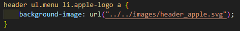

<h2>CSS </h2> 
  <a href='https://developer.mozilla.org/ko/docs/Web/CSS/word-break'>work-break </a> :단어단위로 줄바꿈 설정  
<a href='https://developer.mozilla.org/en-US/docs/Web/CSS/align-items'>align-itmes </a> : 기본값은 nomal이지만 flex 속성 상태의 박스안에서는 기본값이
stretch 속성이 된다.   (교차축에서 최대한 늘어나려는 성질) absolute상태에서 stretch가 되지만 늘어나려는 성질은 갖지않는다.
 
<a href='https://developer.mozilla.org/en-US/docs/Web/CSS/text-indent'>text-indent</a>
 : 내어쓰기,들여쓰기 빈공간을 만들어 글의 시작지점을 조정
background-image를 통해 검색엔진을 위해 대체 텍스트를 사용했을때 -9999px 속성을 적용해서 텍스트가 안보이게 할 수 있음
 

<h2>트러블 슈팅</h2> 
<h4>backgroud이미지 url사용시 notfound </h4>

 
 
<strong>해결방안</strong>  
1. 캐시, 검색기록 삭제 (해결 x)  
2. css파일 연결 link 태그 src경로에 ?after를 추가(./css//main.css?after)(해결x)  
url 경로를 잘보니 imges폴더를 css폴더 안에서 찾고있는것을 발견했다.  경로가 왜 저렇게 인식되는지는 모르겠지만 ../하나더 추가해서 해결  

