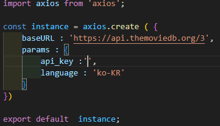

<h3>Axios란?</h3>
<ul>
    <li>Axios 는 브라우저 Node.js를 위한 Promise API를 활용한 HTTP 비동기 통신 라이브러리 이다.</li>
    <li>npm install axios --save.</li>
    <li>axios 인스턴스</li>
    <li>계속해서 사용되는 api 주소를 작성하게되면 코드의 가독서이 떨어지므로 axios를 사용하기전 api주소나, 여러 설정들을 할 수 있다.</li>
    
</ul>
