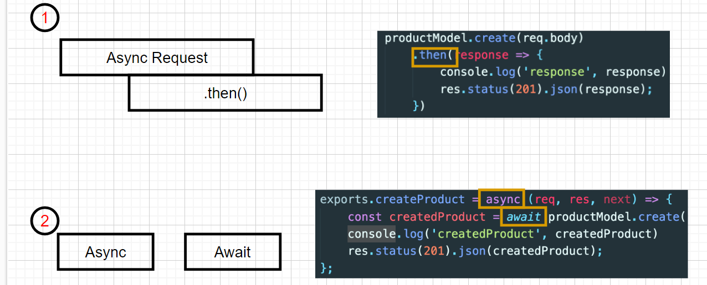

<h3>Axios란?</h3>
<ul>
    <li>Axios 는 브라우저 Node.js를 위한 Promise API를 활용한 HTTP 비동기 통신 라이브러리 이다.</li>
    <li>npm install axios --save.</li>
    <li><a href='https://yamoo9.github.io/axios/guide/api.html#http-%EB%A9%94%EC%84%9C%EB%93%9C-%EB%B3%84%EC%B9%AD'>axios 인스턴스</a></li>
    <li>계속해서 사용되는 api 주소를 작성하게되면 코드의 가독서이 떨어지므로 axios를 사용하기전 api주소나, 여러 설정들을 할 수 있다.</li>
    
</ul>
<h3><a href='https://styled-components.com/'>Styled-components</a></h3>
    <ul>
    <li>리액트 프로그램에서 css를 어떻게 더 잘 처리할지에 대한 생각으로 만들어진 프로그램</li>
    <li>props 전달해서 동적으로 css를 설정할 수있고, 생성시(styled 태그이름) 을 통해 직접 css 를 컴포넌트화 해서 커스터마이징 할 수 있다. </li>
    
</ul>

<h3>useEffect의  클리너 함수 </h3>
    <ul>
        <li>clean-up 함수는 useEffect 내의 함수가 여러번 실행될 때, 다음 useEffect 가 실행되기 전에 실행되는 함수이다.</li> 
        <li>컴포넌트가 언마운트(컴포넌트가 페이지에서 사라지는 시점) 되거나 업데이트 되기 직전에 어떤 작업을 수행하고 싶다면, clean-up 함수를 반환해주어야 한다.</li> 
        <li>선언될 당시의 과거의 변수 값을 참조하고 있던 이펙트가 클린업(정리)되고, 새로운 변수 값을 다시 참조하게 되는 것.</li> 
        <li>clean-up 함수는 보다 효율적으로 useEffect가 작동할 수 있도록 제어하여 메모리 관리를 하기 위함이다</li> 
    </ul>

<h3>API요청중 Promise {'pending'} 이라고 나오는 이유는? </h3>
    <ul>
        <li>Pendding은 아직 비동기 처리가 대기중인 상태 즉 비동기로 처리중이기 때문!</li> 
        
        <li>그래서 비동기 처리가 완료된후 결과값을 받은 이후에 값을 처리해야 한다.</li> 
        
    </ul>

<h3>css 선택자 BEM이란?</h3>
<ul>
    <li>
        BEM은 Block, Element, Modifier로 구성된 클래스 이름을 짓는 CSS 방법론이다.
        BEM 방법론은 id에서 사용하지 않으며, 오직 class명에만 활용할 수 있다."어떻게 보이는가"가 아니라 "어떤 목적인가"에 따라 이름을 짓는다.
    </li>
     
    <li>
        <strong>BEM을 사용하는 이유:</strong>
        <ul>
            <li>
                BEM 명명 규칙은 세 가지 뚜렷한 이점을 제공
            </li>
            <li>BEM은 목적 또는 기능을 전달, BEM은 구성 요소의 구조를 전달 </li>
            <li> BEM은 선택자 특이성을 항상 낮은 수준으로 유지 </li>
        </ul>
    </li>  
    <li>
     <strong>BEM 특징:</strong>
      <ul>
            <li>
               의미론적 클래스 선택자 작명 규칙
            </li>
            <li>약어 사용 피하기 </li>
            <li> 다른 형식의 선택자 사용을 제한 </li>
            <li> --, \_\_ 형식 이외의 다른 형식의 기호 사용 제한 </li>
            <li>전역에서 유일한 이름 권장 </li>
            <li>낮은 선택자 특이성 유지 </li>
            <li>HTML/CSS 연결이 느슨, 병렬 개발 가능</li>
        </ul>
       
</ul>
