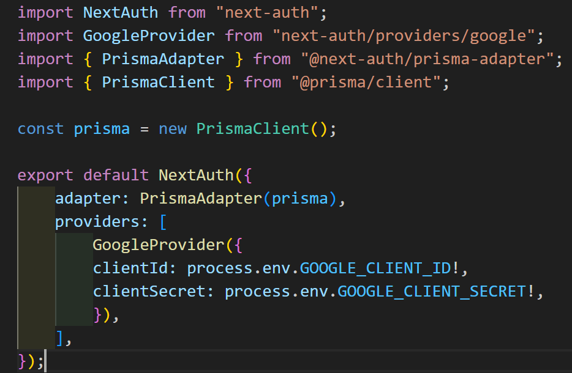
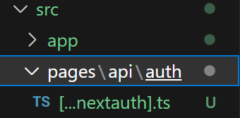
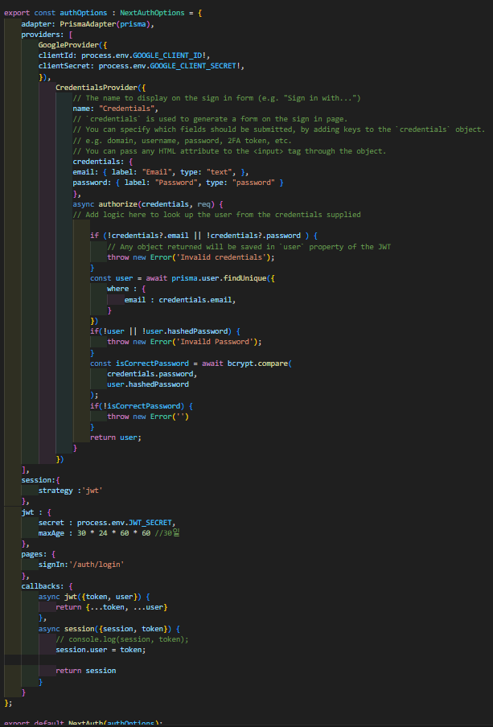

### 추상화란

- 공통의 속성이나 기능을 묶어 이름을 붙이는 것, 객체 지향 관점에 클래스를 정의하는 것을 추상화 라고 할 수 있다.

- 불필요한 부분을 생략하고 객체의 속석 중 가장 중요한 것에만 중점을 두어 개략화 하는 것
  즉 모델화 하는 것으로 데이터의 공통된 성질을 추출하여 슈퍼 클래스를 선정하는 개념이다.

- 소프트웨어 개발관점에서 추상화란 인터페이스에 의존하고, 구체적인 구현에는 의존하지 않는다.
  보통 함수를 기본적인 추상화 방법으로 사용한다.
  실제 출력에 대해 어떻게 동작하는지 알지 못하지만 무엇을 하는지 알고 사용한다.
  함수를 작게 만드는 것이 핵심이며, 함수가 하는 일도 하나여야 한다.

#### 추상화의 장점

- 코드의 재사용성, 가독성 향상 , 생산성 증가, 에러감소 -> 유지보수 시간 단축

### ORM

- 최고 수준의 추상화입니다. ORM으로 작업할 때 일반적으로 더 많은 설정을 사전에 수행해야 합니다. ORM(object relational mapping)은 관계형 데이터베이스의 데이터를 애플리케이션의 객체(클래스 인스턴스)에 매핑하는 것입니다.

- 하나의 소스 코드를 이용해서 여러 데이터베이스로 쉽게 교체 가능합니다.
- 중복 코드 방지
- SQL 인젝션 취약점으로부터 보호
- 모델 유효성 검사 지원
- TypeScript 지원

### Next-auth 사용하기

- next-auth란? next-auth 라이브러리는 next.js 로 구현되어 있는 페이지에서 로그인을 쉽게 구현할 수 있도록 관련 기능을 제공하는 3rd Party 라이브러리이다.  
  https://next-auth.js.org/getting-started/introduction

* 사용 폴더 구조 

* https://authjs.dev/reference/adapter/prisma
  코드 스니펫 복사후 사용
  

### Next-auth 트러블 슈팅

- Next-auth 사용도중 signIn함수를 통해 next-auth 가 제공해주는 로그인 페이지로 이동해야하는 상황에서
  http://localhost:3000/api/auth/error 404 에러가 계속해서 발생했다 구글링을 통해 node 버젼 문제, env NEXTAUTH_URL 경로 등 시도를 많이 해보았지만 해결되지않았다. \*그러다 경로에서 404 문제가 발생하는 것으로 보아
  현재 [...nextauth].ts 경로 위치에 문제가 있는 것 같아 src/app 폴더가 아닌 src/ 경로에 위치하도로 app폴더에서 한번 빼주니 해결하였다.
- https://next-auth.js.org/configuration/initialization 원문

  
  

### Prisma Client 재사용

- Prisma DB에 게속 접근하기위해(API 요청 후 DB 접근,next-auth apter접근 등) prismaClient를 생성하는 파일 생성

  

### Next-auth getServerSession

- 클라이언트에서는 useSession 을 활용해서 user의 session정보를 next-auth를 통해 가져올 수 있다.
- 서버 측에서는 etServerSession을 사용하면 session을 받아 클라이언트측으로 전달 가능하다.
- 데이터베이스와 함께 NextAuth.js를 사용할 때 특히 유용하며 서버 측 에서 사용할 때 API 경로에 대한 추가 항목을 피하기 때문에 응답 시간을 크게 줄일 수 있다. 쿠키 만료 시간을 올바르게 업데이트하고 무언가를 변경한 경우 세션 내용을 업데이트 한다.

* https://next-auth.js.org/configuration/nextjs next.Js 본문
  
