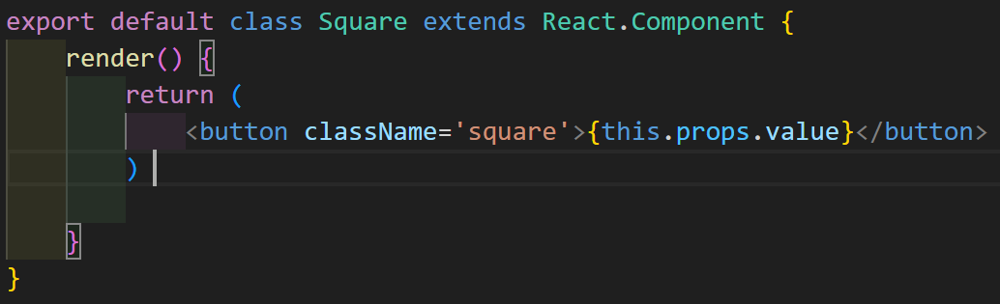
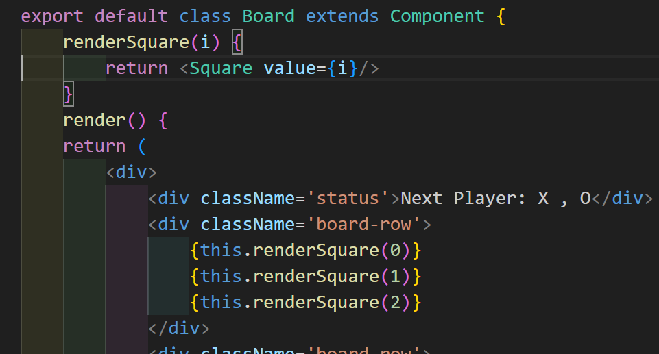
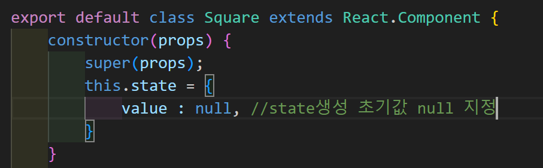
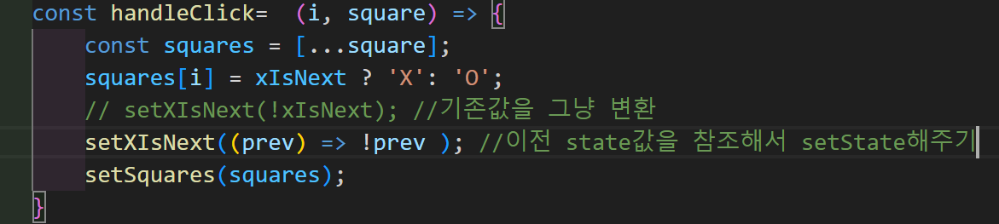

<h3>SPA란?</h3>
<ul>
    <li>웹 사이트의 전체 페이지를 하나의 페이지에 담아 동적으로 화면을 바꿔가면 표현하는것
    Single Page Application</li>
    <li>SPA에서 페이지 전환(브라우징)은 HTML5의 History API를 사용해서 가능하게 만듭니다.
    자바스크립트 영역에서 History API를 이용해서 현재 페이지 내에서 화면 이동이 일어난 것처럼 동작하게 해준다. (React-router-dom이 History API사용)</li>
</ul>

<h3>JSX란</h3>
<ul>
    <li>JSX는 자바스크립트의 확장 문법으로 리액트에서는 JSX를 이용해서 화면 UI가 보이는 모습을 나타냄</li>
    <li>babel을 통해서 리액트 내부적으로 JSX문법을 createElement로 변환시켜서 해석해준다</li>
</ul>

<h3>Props란?</h3>
<ul>
    <li>Properties의 줄임말로 Props는 상속하는 부모 컴포넌트로부터 자녀 컴포넌트에 데이터등을 전달하는 방법</li>
    <li>Props는 읽기 전용(immutable)로 자녀 컴포넌트 입장에서는 변하지 않는다.</li>
    </ul>
<h5>클래스 컴포넌트에서 props받기</h5>
renderSquare라는 함수를 만들어서 value라는 props 지정 후 jsx 태그에서 this.renderSquare(props)를 지정해서 props전달
      props 받는 쪽에서는 jsx태그에서 this.props.value를 통해 받을 수 있다.

<h3>State란?</h3>
<ul>
    <li>컴포넌트의 렌더링 결과물에 영향을 주는 데이터를 갖고 있는 객체 State가 변경되면 컴퍼논트는 리랜더링 된다.</li>
</ul>

<h3>Constructor 생성자란?</h3>
<ul>
    <li>생성자를 사용하면 인스턴스화된 객체에서 다른 메서드를 호출하기전에 수행해야 하는 지정 초기화를 제공할 수 있다.</li>
    <li>클래스를 new를 붙여서 new User('john')
        인스턴스 객체로 생성하면 넘겨받은 인수와 함께 contructor가 먼저 실행된다.
        넘겨받은 인수 john은 this.name에 할당됨
    </li>
    
</ul>

<h3>super 란?</h3>
<ul>
    <li>super키워드는 자식 클래스 내에서 부모 클래스의 생성자를 호출하거나 자식 클래스 내에서 부모 클래스의 메소드를 호출할 때 사용</li>
    <li>생성자에서는 super키워드 하나만 사용하거나 this키워드가 사용되기전에 호출되어야 한다.
    super키워드를 통해 할당되기전에 this를 사용해서 부모 값을 불러오거나 메소드를 호출하게 되면 super키워드가 할당되기전에 사용한것으로 에러 발생
    </li>
    <li><h4>React에서 super에 props를 인자로 전달하는 이유는</h4> React.component객체가 생성될 때 proop 속성을 초기화 하기 위해 부모 컴포넌트에게 props를 전달 해야하며 생성자 내부에서도 this.props를 정상적으로 사용할 수 있도록 보장하기 위해 
    </li>
    <li>constructor 밖에서는 super를통해 전달받지 않아도 this.props를 전달 받을 수 있지만 constructor안에서 사용하기 위해서 super를 통해 전달받아야함!</li>
</ul>

<h3>불변성</h3>
<ul>
    <li>원시 타입은 불변성을 가지고 있고 참조타입은 그렇지 않다</li>
    <li>원사타입 : Boolean, String, Numberm null, undefined, Symbol
    </li>
    <li>
        참조타입 : Object, Array
    </li>
    <li><strong>원시 타입에 대한 참조 및 값을 저장하기 위해 Call Stack 메모리 공간을 사용 하지만 참조 타입의 경우 Heap이라는 별도의 메모리 공간을 사용한다. Call Stack은 객체 및 배열 값이 아닌 메모리에만 Heap 메모리 참조 ID를 값으로 지정</strong></li>
    <li>원시 타입은 고정된 크키로 Call Stack 메모리에 저장 실제 데이터 변수 할당</li>
    <li>데이터 크기가 정해지지 않고 Call Stack 메모리에 저장, 데이터의 값이 heap에 저정되며 heap메모리에 주소값이 할당</li>
    <h4>불변성을 지켜야 하는 이유?</h4>
    <li>참조 타입에서 객체나 배열의 값이 변할 때 원본 데이터가 변경되기에 이 원본 데이터를 참조하고 있는 다른 객체에서 예상치 못한 오류가 발생할 수 있어서 프로그래밍의 복잡도가 올라간다</li>
      <li>리액트에서 화면을 업데이트할 때 불변성을 지켜서 값을 이전 값과 비교해서 변경된 사항을 확인한 후 업데이트하기 때문에 불변성을 지켜줘야 합니다.</li>
</ul>

<h3>HOC (Higher Order Component) 란?</h3>
<ul>
    <li>화면에서 재사용 가능한 로직만을 분리해서 components로 만들고, 재사용 불가능한 UI와 같은 다른 부분들은 parameter로 받아서 처리하는 방법</li>    
    <li>Hooks가 나오기 이전에는 많은 Wrapper 컴포넌트가 생길 수 있는 문제가 있었음 
    데이터의 흐름을 파악하기 힘듬!</li>    
    <li>React Hooks에서 Hoc대신에 따로 Custom hooks를 이용해서 컴포넌트를 만들어서 처리를 한다</li>    
</ul>

<h3>리액트 Batching</h3>
<a href='https://react.dev/blog/2022/03/29/react-v18#new-feature-automatic-batching'>리액트 원본 링크 </a>
Batching이란 React가 더 나은 성능을 위해 여러개의 state 업데이트를 한 번의 리렌더링으로 묶어서 진행하는 것을 말한다.Batching은 반드시 필요한 하나의 리렌더링을 수행한다.

해당 주석된 코드는 batching 기능에 의해 해당코드가 여러번 시도되어도 한번만 실행하게 된다.
하지만 밑에있는 안에서 콜백함수를 통해 prev인자를 받아 이전 state를 참조해 변경을 주면 batching 기능에 감지되지않고 여러번 수행 가능하다.
   

<h3>JSX key 속성</h3>
    <ul>
        <li>리액트에서 요소의 리스트를 나열할 때는 key 속성을 부여해야함! 키는 React 변경, 추가, 제거된 항목을 식별하는데 도움이 된다. 요소에 안정적인 ID를 부여하려면 배열 내부의 요소에 키를 제공하면  된다</li>
        <li>리액트에서 이전 돔과 바뀐 돔을 비교할 때(diffing) key를 이용해서 리스트의 바뀐 부분을 찾을 수 있다.</li>
        <li><strong>key는 변하지 않고, 예상가능하며, 유일해야합니다.</strong>  배열의 index로 key를 사용하면 재배열이 일어날 경우, 컴포넌트의 state 관련하여 문제가 발생할 수 있다. 컴포넌트는 key 를 보고 갱신되고 재사용됩니다. index를 사용했다면 항목의 순서가 바뀌었을 경우 key 또한 바뀌었을 거고 이는 state를 엉망으로 만들거나 원하지 않는 방식으로 컴포넌트를 바꿀 수 있습니다.
        </li>
    </ul>

<h3>React Profiler 란?</h3>
    <ul>
        <li>React 16.5 에서 새로운 Dev Tools 프로 파일러 플러그인에 대한 지원을 추가해준다</li>
        <li>리액트의 성능 병목 현상을 식별하기 위해 렌더링 되는 각 구성 요소에 대한 타이밍 정보를 수집한다.</li>
    </ul>

<h3>React memo 란?</h3>
    <ul>
        <li>컴포넌트를 렌더링 한 뒤, 이전에 렌더링 된 결과와 비교하여 DOM업데이트를 결정합니다. 렌더링 결과가 이전과 다르다면 React.DOM을 업데이트 합니다. 
        이 과정에서 컴포넌트가 React.memo() 로 둘러 쌓여 있다면 React는 컴포넌트를 렌더링하고 결과를 메모이징 한다.
        그리고 다음 렌더링이 일어날 때 렌더링하는 컴포넌트의 props가 같다면, React는 메모이징된 내용을 재사용 한다.</li>
        <h4>
        메모이제이션(Memoization)</h4>
        <li>Memoization은 주어진 입력값에 대한 결과를 저장함으로써 같은 입력값에 대해 함수가 한번만 실행되는 것을 보장한다.</li>
        <li>React.memo()시에 props, props 객체를 비교할 때 얕은 비교를 한다.</li>
        <h4>React.memo()사용을 지양해야하는 상황</h4>
        <li>props가 자주 변하는 컴포넌트를 React.memo()로 래핑 하더라도 React는 두가지 작업을 리렌더링 할 때마다 수행한다.  
        1. 이전 props와 다음 props 의 동등 비교를 위해 함수를 수행한다.   
        2. 비교 함수는 거의 항상 false를 반환할 것이기 때문에 React는 이전 렌더링 내용과 다음 렌더링 내용을 비교한다.</li>
        <li><strong>비교 함수의 결과는 대부분 false 반환하기에 props비교는 불필요하게 된다.</strong></li>
        <h3>React.momo()는 렌더링을 막기 위한 도구보다는 성능 개선의 도구이다.</h3>
        <li>React.momo()에 의존하는 것은 버그를 유발할 수 있다.</li>
    </ul>
    <h3>React.useCallback이 란?</h3>
    <ul>
        <li>원래 컴포넌트가 렌더링 될 때 그안에 있는 함수도 다시 만들게 됩니다. 하지만 똑같은 함수를 컴포넌트가 리렌더링 된다고 해서 계속 다시 만드는 것은 좋은 현상은 아니다! </li>
        <li>컴포넌트가 리렌더링 될 때마다 함수가 만들어지고 props로 전달하게 된다면 자식 컴포넌트도 함수가 새롭게 만들어지니 계속 리렌더링 하게 됩니다. </li>
        <li>React.memo() 로 감싸주었던 컴포넌트도 함수가 재생성되면 상관없이 다시 리렌더링 하게된다.</li>
        <li>useCallback은 메모이제이션된 함수를 반환하는 함수입니다. 
        const testFunc = useCallback(() => { },[ ] )</li>
          <li>함수 내에 참조하는 state, porps가 있다면 의존성 배열에 추가하며
          useCallback으로 인해서 의존성 배열에 추가해준 state 혹은 props가 변하지 않는다면 함수는 새로 생성되지 않는다. 의존성 배열에 아무것도 없다면 컴포넌트가 최초 렌더링시에만 함수가 생성되며 그 이후에는 동일한 참조값을 사용하는 함수가 된다.</li>
    </ul>
     <h3>React.useMemo 란?</h3>
    <ul>
        <li>컴포넌트에 작성된 함수가 복잡한 연산을 수행하게 된다면 결과 값을 리턴하는데 오랜 시간이 걸리게 됩니다 그때 사용하는것이 useMemo() </li>
        <li>useMemo 함수에 넘겨주는 의존성 배열에 참조 인자 값이 이전과 동일하다면 컴포넌트가 리렌더링 되지않고 저장해두었던 값을 사용 </li>
    </ul>
